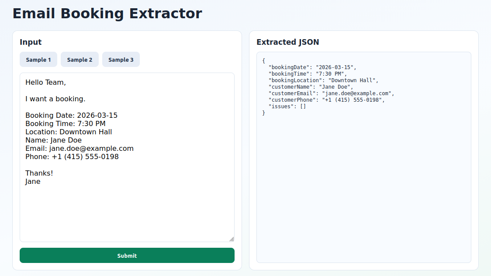
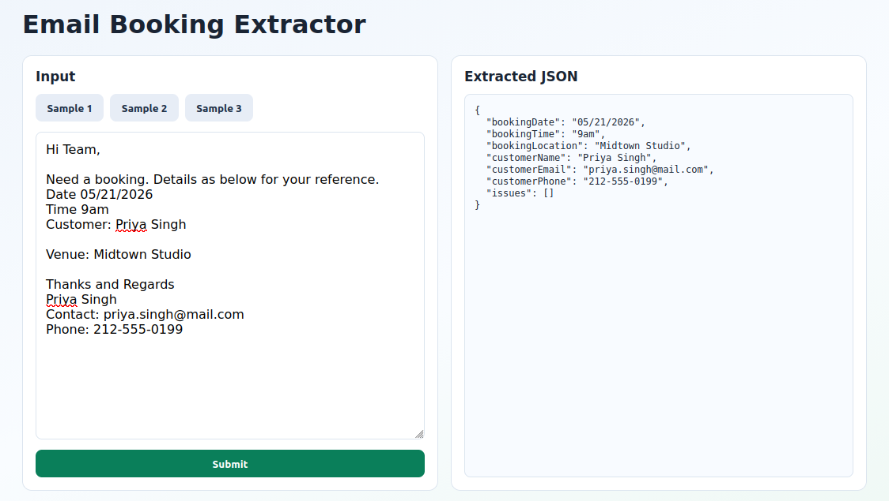
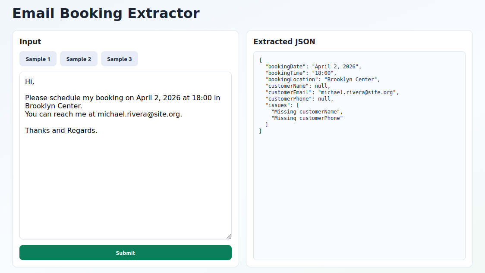

# Email Booking Extractor (Next.js)

Single-page Next.js app with a 2-column layout:
- Left: textarea input, sample-fill buttons, and submit button
- Right: extracted JSON pretty print

Extraction runs in the browser using regex + simple rules.

## Extracted fields
- `bookingDate`
- `bookingTime`
- `bookingLocation`
- `customerName`
- `customerEmail`
- `customerPhone`

If a field is not found, it is returned as `null`, and `issues` includes a missing-field message.

## Run locally
```bash
npm install
npm run dev
```

Then open `http://localhost:3000`.

## Screenshots



